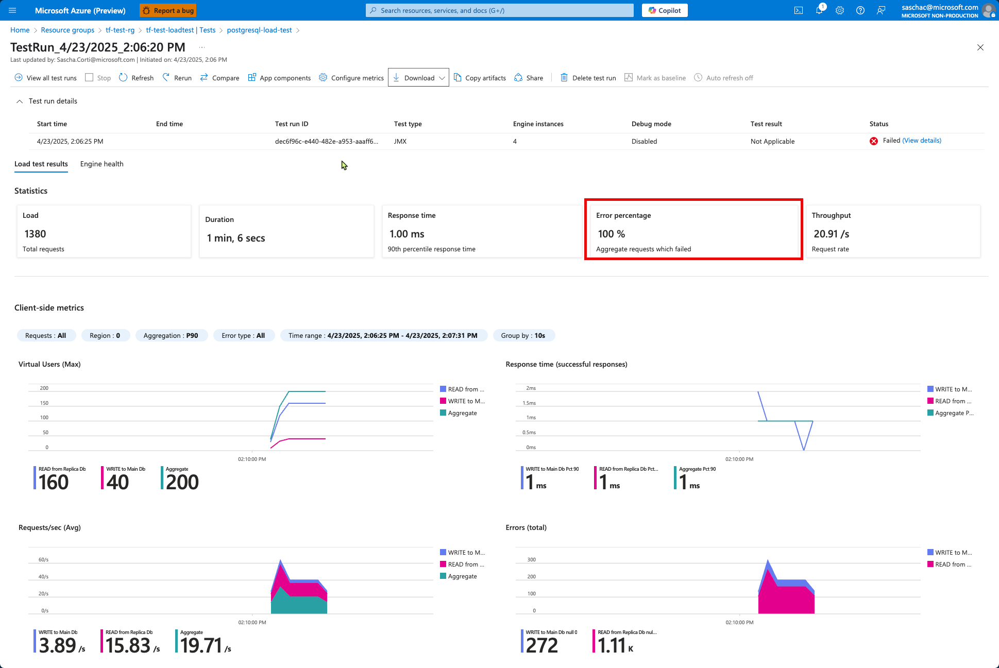
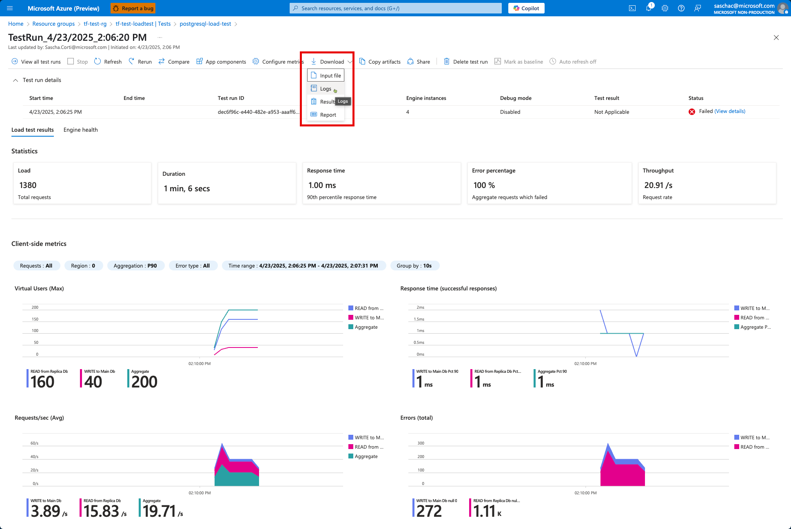

# 🔄 Azure Load Test for Azure Database for PostgreSQL Flexible Server with Replica

This project uses Terraform to deploy Azure Load Test resources and includes a Python application for database management.
The configuration deploys an Azure Load Test resource, an Azure KeyVault, an Azure Database for PostgreSQL Flexible Server with a replica, and a User Assigned Managed Identity to access KeyVault from the load test.
The load test uses an Apache JMeter script to test the database.
User credentials and JMeter script parameters are stored in the KeyVault.

## 📋 Prerequisites

Before you can use this project, you need to have the following tools installed:

- **Python 3.11+**: [Download from python.org](https://www.python.org/downloads/)
- **Poetry**: [Installation instructions](https://python-poetry.org/docs/#installation)
- **Terraform 1.5+**: [Download from terraform.io](https://www.terraform.io/downloads)
- **Azure CLI**: [Installation instructions](https://docs.microsoft.com/en-us/cli/azure/install-azure-cli)
  - Logged in to your Azure account (`az login`)
  - Subscription set (`az account set --subscription <subscription-id>`)
- **Git**: [Download from git-scm.com](https://git-scm.com/downloads)
- **PostgreSQL Client** (optional): [Download from postgresql.org](https://www.postgresql.org/download/)
- **Streamlit** (for running the web app): Installed via Poetry
- **Make** (for using the Makefile): Typically pre-installed on Linux/Mac, for Windows use [GnuWin32](http://gnuwin32.sourceforge.net/packages/make.htm)

## 📂 Project Structure

### 🏗️ Infrastructure as Code

- `terraform/`: Contains the Terraform configuration for deploying all infrastructure
  - `terraform/main.tf`: Main Terraform configuration file
  - `terraform/variables.tf`: Variable definitions
  - `terraform/outputs.tf`: Output definitions
  - `terraform/data.tf`: Data sources
  - `terraform/load_test.tf`: Load test specific resources
  - `terraform/setup_load_test.sh`: Script to automate load test configuration
  - `terraform/load_test_variables.env`: Generated environment variables for load testing
  - `terraform/env_vars.json`: Configuration for local environment variables
- `load_test_artifacts/`: Contains JMeter script and PostgreSQL JDBC driver for load testing
  - `load_test_artifacts/jmeter_script.jmx`: JMeter test plan
  - `load_test_artifacts/postgresql-42.7.5.jar`: JDBC driver for PostgreSQL

### 🐍 Python Database Application

The project includes a Python application in the `create_database` directory that helps create and populate the PostgreSQL database:

- `create_database/database_setup.py`: Python script to initialize and populate the PostgreSQL database
- `create_database/verify_replication.py`: Python script to verify replication between primary and replica databases
- `create_database/streamlit_app.py`: Streamlit web application to view and edit data in the database
- `create_database/data/sample_data.json`: Sample data for database initialization

## 🔧 Preparation

In the `/terraform/terraform.tfvars` file, replace the default values with names that suit you. Also make sure to include your valid subscription id.

```yaml
subscription_id            = "<your subscription id>"
resource_group_name        = "resource-group-name"
load_test_name             = "loadtest-name"
identity_name              = "user-assigned-identity-name"
key_vault_name             = "keyvaultname"
postgres_server_name       = "postgresservername"
postgres_admin_username    = "pgadmin"
postgres_admin_password    = "<your custom password>"
```

in the `Makefile`, add your subscription id to the line

```plain
SUBSCRIPTION_ID ?= <your-subscription-id>
```

## 🚀 Deployment

### 🎯 Overview of the 9 simple steps needed to deploy, configure and run the solution

1. Login to Azure with the Azure CLI `az login` and set the subscription with `az account set --subscription <subscription-id>`
2. Initialize Terraform with `make init`
3. Validate the Terraform configuration with `make validate`
4. Preview the changes with `make plan`
5. Apply the configuration with `make apply`
6. Run the Python scripts to create and populate the database
  6.1 Run `database_setup.py` to create the database and populate it with sample data
  6.2 Run `verify_replication.py` to verify that the data is replicated correctly
7. cd to the `terraform` subfolder and run the script `setup_load_test.sh` to configure the load test
8. Manually upload the JDBC driver located in `load_test_artifacts/postgresql-42.7.5.jar` to the Azure Load Test resource and finalize the test configuration as outlined in the [Load Testing Configuration](#🧪-load-testing-configuration) section
9. Run the load test from the Azure Portal

### 📝 Using the Makefile

The project includes a Makefile to simplify the Terraform deployment process:

```bash
# Show available commands
make help

# Login to Azure
make login

# Set the subscription
make set-subscription SUBSCRIPTION_ID=your-subscription-id

# Initialize Terraform
make init

# Validate Terraform configuration
make validate

# Preview changes
make plan SUBSCRIPTION_ID=your-subscription-id

# Apply configuration
make apply SUBSCRIPTION_ID=your-subscription-id

# Destroy infrastructure when done
make destroy SUBSCRIPTION_ID=your-subscription-id
```

### ⌨️ Manual Terraform Commands

If you prefer not to use the Makefile, you can run the Terraform commands directly:

```bash
# Initialize Terraform
cd terraform
terraform init

# Validate configuration
terraform validate

# Review deployment plan
terraform plan -var="subscription_id=your-subscription-id"

# Apply the configuration
terraform apply -var="subscription_id=your-subscription-id"

# Destroy resources when done
terraform destroy -var="subscription_id=your-subscription-id"
```

You can customize the deployment by:
1. Editing variables directly in the terraform files
2. Creating a `terraform.tfvars` file with your custom values
3. Passing variables on the command line:
   ```bash
   terraform apply \
     -var="subscription_id=your-subscription-id" \
     -var="resource_group_name=my-custom-rg" \
     -var="location=westeurope"
   ```

## 🐍 Python Application Setup

The Python scripts are used to create the database and populate some initial values before running the load test.

The Python application is built using Poetry for dependency management.

### 🔧 Setup the Python Environment

```bash
# Install dependencies using Poetry
poetry install

# Activate the virtual environment
poetry shell
```

### 🔌 Configure Database Connection

When running the Terraform scripts, the `/terraform/load_test_variables.env` file is automatically generated which is used for the Python scripts to connect to the primary and the replica databases.

### ▶️ Running the Application

You can run the applications using the VS Code launch profiles or directly from the command line:

```bash
# Initialize and populate the database
python create_database/database_setup.py

# Verify replication between primary and replica databases
python create_database/verify_replication.py

# Start the Streamlit web application
streamlit run create_database/streamlit_app.py
```

### 🧩 VS Code Launch Profiles

The project includes three VS Code launch profiles:

1. **DB Initialization** - Runs the database setup script to initialize and populate the database
2. **Verify Replication** - Checks if data is properly replicated between primary and replica databases
3. **Streamlit App** - Launches the Streamlit web application for viewing and editing data

## 🏢 Resources Created

- Resource Group
- Azure Load Test resource
- Azure Load Test configuration with JMeter
- User Assigned Managed Identity
- Key Vault with the Managed Identity assigned as Key Vault Administrator
- PostgreSQL Flexible Server (Memory Optimized, Standard_E2ds_v5)
  - Primary server
  - Test database
  - Public network access enabled
  - Microsoft Entra authentication enabled
- PostgreSQL Flexible Server Replica
  - Read-only replica of the primary server
  - Created using 'Replica' create mode

## 🧪 Load Testing Configuration

The deployment includes a JMeter-based load test configuration with:

- Separate thread groups for primary write operations and replica read operations
- Configurable thread counts, loops, and operations per minute
- PostgreSQL JDBC driver for database connectivity
- Reference to Key Vault secrets for database credentials
- User Assigned Managed Identity for secure Key Vault access
- Monitoring of PostgreSQL server metrics during test execution

### 🤖 Automated Load Test Setup

After deploying the infrastructure with Terraform, you can use the included setup script to configure the load test:

```bash
# Navigate to the Terraform directory
cd terraform

# Make the script executable if needed
chmod +x setup_load_test.sh

# Run the setup script
./setup_load_test.sh
```

The script automatically:
- Creates or updates the load test configuration
- Sets up the JMeter test with proper parameters
- Configures Key Vault references for secure credential access
- Provides guidance for any manual steps that might be needed

### 👤 Manual Steps for Load Testing

Some aspects of load test configuration may still require manual steps. See the output of the `setup_load_test.sh` script for details.

1. Navigate to the Azure Portal → Azure Load Testing → [Load Test Name] → Tests
2. Click on the test configuration
3. Click 'Configure', and ensure:
   - The JDBC driver `postgresql-42.7.5.jar` is uploaded in the 'Additional Files' section
   - Identity is set to 'User-assigned identity' with the correct managed identity in the `Test Plan`, `Parameters` and `Monitoring` sections
   - Both PostgreSQL servers are added to the monitoring section
4. Save the test configuration
5. Run the test and monitor the performance of both primary and replica servers

## 🔄 Post-Deployment Steps

The Terraform deployment automatically configures the User Assigned Managed Identity as a Microsoft Entra administrator for the PostgreSQL server. No manual steps are required for the Entra admin configuration.

### 🔑 Load Test Environment Variables

After deployment, Terraform generates a `load_test_variables.env` file in the terraform directory containing all necessary configuration variables for the load test, including:

- Resource group name and load test resource name
- PostgreSQL server information (primary and replica)
- Test parameters (threads, loops, operations per minute)
- Key Vault secret references
- Managed identity information
- File paths for JMeter script and JDBC driver

This file is sourced by the `setup_load_test.sh` script to configure the load test. You can also use it as a reference for manual configuration or troubleshooting.

## 🛡️ Terraform Reliability Features

This Terraform configuration implements several reliability features to handle Azure API limitations:

1. **Extended Timeouts**: All resources have configured timeouts to allow more time for operations to complete.

2. **Time Delays**: Strategic delays between operations using `time_sleep` resources:
   - 30-second delay after PostgreSQL server creation before creating firewall rules
   - 60-second delay before creating the replica server
   - 30-second delay before creating Key Vault secrets

3. **Explicit Dependencies**: Resources declare explicit dependencies to ensure proper provisioning order.

4. **Azure Provider Configuration**:
   - Higher timeouts for client operations (30 minutes)
   - Improved recovery options for Key Vault and other resources
   - Force wait for PostgreSQL operations to complete

5. **PostgreSQL-specific Improvements**:
   - Firewall rules creation separated to avoid concurrent operation issues
   - Replica server created only after database is confirmed ready
   - Careful ordering of resource creation to avoid "server busy" errors

These features help avoid common deployment issues with Azure PostgreSQL Flexible Server, such as:
- "Server busy with another operation" errors
- Key Vault access policy conflicts
- Timing issues with replica creation
- Secret creation failures

## 📝 Notes

- The PostgreSQL password is stored in the Terraform state file in plaintext. For production, consider using a more secure approach for secrets management.
- The Load Test files need to be uploaded manually as Terraform doesn't support direct file uploads.

## 👻 Error Handling

If the load test fails, you will see the the error percentage go to 100% and the test will be marked as failed. You can check the `csv` and `log` files for more details.



Download the csv and log files from the Azure Portal and extract them.



Check them for errors.

```log
timeStamp,elapsed,label,responseCode,responseMessage,threadName,dataType,success,failureMessage,bytes,sentBytes,grpThreads,allThreads,URL,Latency,IdleTime,Connect
1745410226511,1,WRITE to Main Db,null 0,java.sql.SQLException: Cannot create JDBC driver of class 'org.postgresql.Driver' for connect URL 'jdbc:tftestpgserver.postgres.database.azure.com:5432/test',Thread Group Write Main Db 1-1,text,false,,134,0,1,1,null,0,0,1
1745410226535,3,READ from Replica Db,null 0,java.sql.SQLException: Cannot create JDBC driver of class 'org.postgresql.Driver' for connect URL 'jdbc:tftestpgserverrepl.postgres.database.azure.com:5432/test',Thread Group Read ReplicaDb 2-1,text,false,,138,0,1,2,null,0,0,3
1745410226775,1,READ from Replica Db,null 0,java.sql.SQLException: Cannot create JDBC driver of class 'org.postgresql.Driver' for connect URL 'jdbc:tftestpgserverrepl.postgres.database.azure.com:5432/test',Thread Group Read ReplicaDb 2-2,text,false,,138,0,2,3,null,0,0,1
1745410226784,1,READ from Replica Db,null 0,java.sql.SQLException: Cannot create JDBC driver of class 'org.postgresql.Driver' for connect URL 'jdbc:tftestpgserverrepl.postgres.database.azure.com:5432/test',Thread Group Read ReplicaDb 2-1,text,false,,138,0,2,3,null,0,0,1
1745410227024,1,READ from Replica Db,null 0,java.sql.SQLException: Cannot create JDBC driver of class 'org.postgresql.Driver' for connect URL 'jdbc:tftestpgserverrepl.postgres.database.azure.com:5432/test',Thread Group Read ReplicaDb 2-3,text,false,,138,0,3,4,null,0,0,1
1745410227273,1,READ from Replica Db,null 0,java.sql.SQLException: Cannot create JDBC driver of class 'org.postgresql.Driver' for connect URL 'jdbc:tftestpgserverrepl.postgres.database.azure.com:5432/test',Thread Group Read ReplicaDb 2-4,text,false,,138,0,4,5,null,0,0,1
1745410227275,6,READ from Replica Db,null 0,java.sql.SQLException: Cannot create JDBC driver of class 'org.postgresql.Driver' for connect URL 'jdbc:tftestpgserverrepl.postgres.database.azure.com:5432/test',Thread Group Read ReplicaDb 2-2,text,false,,138,0,4,5,null,0,0,6
1
```
